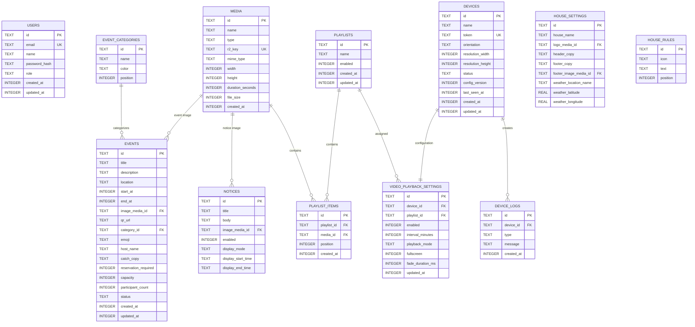

# シェアハウス向けデジタルサイネージ 要件定義書

## 1. プロジェクト概要

### 1.1 システム名

仮称：

**Share House Signage**

### 1.2 目的

シェアハウス内に設置された大型ディスプレイに、以下の情報を常時表示するデジタルサイネージシステムを構築する。

- 本日のイベント
- 今後開催予定のイベント
- イベント詳細
- 開催場所
- 開催時間
- イベント画像
- QRコード
- お知らせ
- 定期動画

受付スタッフが専門知識なしで管理画面からイベントや動画を登録・変更できることを重視する。

表示端末には **Raspberry Pi 4 / 4GB** を使用する。

---

# 2. システム全体構成

```text
受付スタッフ
    │
    ▼
Web管理画面
Next.js
    │
    ▼
Cloudflare Workers
    │
    ├────────── Turso
    │            イベント
    │            設定
    │            端末
    │            プレイリスト
    │
    └────────── Cloudflare R2
                 │
                 ├─ 画像
                 └─ 動画

────────────────────────

Raspberry Pi 4
    │
    ├─ Chromium Kiosk
    │      │
    │      └─ イベントサイネージ表示（http://localhost を表示）
    │
    └─ Signage Agent
           │
           ├─ 設定同期
           ├─ 画像・動画ダウンロード
           ├─ ローカル表示サーバー（表示ページとキャッシュデータを配信）
           ├─ Heartbeat
           └─ mpv制御
                  │
                  ▼
             全画面動画再生
```

---

# 3. 使用技術

## 3.1 Webアプリケーション

| 項目 | 技術 |
|---|---|
| Framework | Next.js |
| UI Library | React |
| Language | TypeScript |
| CSS | Tailwind CSS |
| Components | shadcn/ui |
| Icons | Lucide |
| Form | React Hook Form |
| Validation | Zod |
| Date | date-fns |
| ORM | Drizzle ORM |

---

## 3.2 Backend

| 項目 | 技術 |
|---|---|
| Backend | Next.js Route Handlers / Server Actions |
| Runtime | Cloudflare Workers |
| Deployment | Cloudflare |
| Next.js Adapter | vinext |
| Authentication | Auth.js |
| API | REST |

---

## 3.3 Database

**Turso**

- SQLite / libSQL
- Drizzle ORMからアクセス

---

## 3.4 Storage

**Cloudflare R2**

用途：

- イベント画像
- 動画
- サムネイル

---

## 3.5 Raspberry Pi

| 項目 | 技術 |
|---|---|
| Device | Raspberry Pi 4 4GB |
| OS | Raspberry Pi OS 64bit |
| Browser | Chromium |
| Browser Mode | Kiosk |
| Controller | Python |
| Video Player | mpv |
| Service Management | systemd |
| Video Cache | ローカルストレージ |
| Local Display Server | Python（Agent に同梱。localhost で表示ページとキャッシュを配信） |
| RTC | 電池付き外付け RTC（DS3231 等）。オフライン再起動時の時刻保持のため必須 |
| Storage | 高耐久 microSD または USB SSD（32GB 以上） |

---

# 4. ユーザー

## 4.1 Administrator

システム全体を管理するユーザー。

権限：

- イベント作成
- イベント編集
- イベント削除
- メディア管理
- 動画設定
- デバイス管理
- ユーザー管理
- システム設定

---

## 4.2 Staff

主に受付スタッフ。

権限：

- イベント作成
- イベント編集
- イベント削除
- 画像アップロード
- 動画選択
- 動画再生設定
- お知らせの編集
- テスト表示

デザイン設定・表示スケジュール・端末・ユーザー・システム設定は操作できない。

技術的な設定項目は表示しない。

---

# 5. 管理画面要件

## 5.1 Dashboard

ログイン後のトップ画面。

表示：

- 今日の日付
- 今日のイベント
- 次のイベント
- サイネージオンライン状態
- 現在表示しているコンテンツ
- 動画再生設定
- 次の動画再生予定時間
- 今週のカレンダー（イベントのある日にカテゴリ色のドット）
- イベント一覧（すべて / 開催前 / 開催中 / 終了 の絞り込み、検索）
- お知らせ表示の設定（ON/OFF、本文、表示する時間帯）
- サイネージプレビュー（端末の向きに合わせた縮小表示、テスト表示ボタン）
- ログイン中ユーザーの名前・役割

レイアウトは `image/dashboard.png` を正とする。

例：

```text
Harmony House

今日のイベント

Pizza Night
19:30 - 21:30
2F Lounge

[編集]


サイネージ

Lobby Display
● オンライン


定期動画

● ON

10分ごと

次回
20:40
```

---

# 6. イベント管理

## 6.1 イベント一覧

以下を表示。

- イベント名
- 日付
- 開始時間
- 終了時間
- 場所
- 公開状態
- サムネイル

表示方式：

- リスト
- カレンダー

---

# 7. イベント登録

受付スタッフが以下を入力する。

### 必須

- イベント名
- 開始日時

### 任意

- 終了日時
- 開催場所
- 説明
- イベント画像
- QRコードURL
- カテゴリ（映画 / アウトドア / 交流 / ワークショップ / その他。カテゴリごとにタグ色を持つ）
- 絵文字（タイトル横に表示。例: 🍕）
- 主催者名
- キャッチコピー（サイネージの写真上に手書き風で表示。例: Good Food / Good People!）
- 参加形態（参加自由・予約不要 / 定員あり）
- 定員・参加人数（定員ありの場合。参加人数は受付スタッフが手入力する）

開催前 / 開催中 / 終了 の状態は開始・終了日時から自動判定し、入力項目にしない。カテゴリとは別に表示する。

画面イメージ：

```text
新しいイベント

イベント名
[ Pizza Night ]

日付
[ 2026/09/24 ]

開始
[ 19:30 ]

終了
[ 21:30 ]

場所
[ 2F Lounge ]

画像
[ アップロード ]

参加URL
[ https://... ]

[ 公開する ]
```

---

# 8. サイネージ表示

通常時は以下の情報を表示する。

レイアウトは端末の向きで切り替える。

- 縦型（1080 x 1920）: `image/UI-V.png` を正とする
- 横型（1920 x 1080）: `image/UI-H.png` を正とする

## 8.0 画面構成要素

| 要素 | 内容 | 縦型 | 横型 |
|---|---|---|---|
| ヘッダー | ロゴ、ハウス名、キャッチコピー | ○ | ○ |
| 時計・日付・天気 | 現在時刻、日付と曜日、気温と天気アイコン、地域名 | ○ | ○（下部バー） |
| 今日のイベント | 8.1 参照 | ○ | ○ |
| Upcoming Events | 9 参照。カテゴリタグと画像つき | ○ | ○ |
| 今週の予定（THIS WEEK） | 月〜日の7日分。イベントのある日にアイコン | × | ○ |
| お知らせ（HOUSE NEWS） | 画像、見出し、本文 | ○ | ○ |
| ハウスルール（HOUSE RULES） | アイコンと文言を3件 | ○ | ○ |
| フッターコピー | 背景画像とコピー（例: Same House, Different Stories.） | ○ | ○ |

タッチ操作はしないため、「詳細はこちら」等のボタンや矢印は装飾として扱い、押下動作は持たせない。

## 8.1 今日のイベント

表示項目：カテゴリタグ、タイトル、絵文字、説明、時間、場所、参加形態（参加自由 / 参加人数・定員）、主催者、QRコード、イベント画像、キャッチコピー。

最も重要なイベントを大きく表示。

```text
TODAY

Pizza Night

19:30 - 21:30

2F Lounge

Everyone Welcome
```

---

# 9. Upcoming Events

今後開催されるイベントを表示。

```text
UPCOMING EVENTS

SEP 25
Movie Night

SEP 27
BBQ Party

SEP 30
English Meetup
```

表示件数：

最大5件程度。

---

# 10. イベント状態

イベント開始時間に応じて自動表示を変更する。

## 通常

```text
TODAY
```

---

## 開始30分前

```text
STARTING SOON

Pizza Night

19:30 START
```

---

## 開催中

```text
NOW HAPPENING

Pizza Night

2F Lounge

COME JOIN US!
```

---

# 11. 動画再生機能

重要機能。

サイネージ通常表示中に、指定された間隔で動画を全画面再生する。

例：

```text
イベント画面

↓
10分経過

↓
Fade Out

↓
動画

FULL SCREEN

↓
動画終了

↓
Fade In

↓
イベント画面
```

---

# 12. 動画再生間隔

管理画面から選択可能。

間隔は「前の動画の終了から次の動画の開始までの待ち時間」とする。1回に1本再生する。

標準候補：

```text
5分

10分

15分

20分

30分

60分
```

デフォルト：

```text
10分
```

---

# 13. 動画プレイリスト

複数動画を登録可能。

例：

```text
Welcome Movie

↓

House Event Movie

↓

House Rules Movie

↓

Welcome Movie
```

再生方式：

### Sequence

登録順。

### Random

ランダム。

デフォルト：

```text
Sequence
```

---

# 14. 動画管理画面

受付スタッフ向けには以下のみ表示。

```text
定期動画

ON / OFF


動画を流す間隔

[10分ごと]


再生する動画

☰ Welcome Movie

☰ Event Movie

☰ House Rules


再生順

● 順番

○ ランダム


動画終了後

● イベント画面に戻る


[保存]
```

---

# 14B. その他の管理画面（デザインモック由来）

## お知らせ

- 見出し、本文（100文字まで）、画像（任意）
- ON / OFF
- 表示する時間帯（常に表示 / 時間帯指定）
- サイネージの HOUSE NEWS 欄に表示する

## デザイン設定

- ハウス名、ロゴ
- キャッチコピー（ヘッダー用、フッター用）
- フッター背景画像
- ハウスルール（アイコンと文言。3件）
- 天気を表示する地域

## 表示スケジュール

曜日ごとにサイネージを表示する時間帯を設定する（日をまたぐ時間帯も可。未設定の曜日は終日表示）。時間外は画面出力を止め、動画も再生しない。Administrator のみ操作できる。

## 利用ガイド

受付スタッフ向けの操作説明ページ（静的ページ）。

---

# 15. 動画仕様

推奨フォーマット：

```text
Container:
MP4

Codec:
H.264

Resolution:
1920 x 1080

または

1080 x 1920

Frame Rate:
30fps
```

4K動画は基本的に使用しない。

1ファイルの上限は 500MB。Raspberry Pi 実機で再生を確認した条件（解像度・プロファイル・フレームレート等）を満たさない動画はプレイリストに追加できない。

大型4Kディスプレイの場合も、Raspberry Piから1080p出力し、ディスプレイ側でアップスケールする。

---

# 16. 動画配信

R2から動画を直接ストリーミングし続けない。

以下の方式とする。

```text
R2

↓

Raspberry Pi

↓

ローカル保存

↓

mpv

↓

再生
```

---

# 17. 動画キャッシュ

保存先：

```text
/var/lib/sharehouse-signage/videos/
```

例：

```text
welcome.mp4

event.mp4

rules.mp4
```

新しい動画が登録された場合のみダウンロードする。

---

# 18. 動画再生エンジン

Electronは使用しない。

**mpvを使用する。**

理由：

- 軽量
- Raspberry Piで動かしやすい
- 全画面表示可能
- ハードウェアデコードを利用しやすい
- CLI操作可能
- Pythonから制御しやすい

---

# 19. サイネージブラウザ

通常画面はChromium Kioskで表示。

Chromium はクラウドではなく、Pi 内の Signage Agent が配信するローカルページを開く。
これにより、ネット切断中に Pi が再起動しても表示できる（23 参照）。

例：

```bash
chromium \
  --kiosk \
  --noerrdialogs \
  --disable-infobars \
  http://localhost:8080/
```

管理画面のサイネージプレビューは、管理画面のログインで認証する `/admin/devices/{id}/preview` で表示する。表示ページは Pi とプレビューで同じコンポーネントを使う。

---

# 20. Raspberry Pi Agent

Python製常駐プログラム。

機能：

- APIアクセス
- 設定取得
- イベント情報同期
- 動画一覧同期
- R2動画・画像ダウンロード
- ローカル表示サーバー（表示ページの静的ファイル、キャッシュ済みデータ、画像を localhost で配信）
- 表示ページへの通知（動画再生前のフェードアウト指示、データ更新の通知）
- mpv起動
- Heartbeat
- エラー通知
- ローカルキャッシュ管理

---

# 21. 同期

PiからCloudflare APIへ定期問い合わせ。

間隔：

```text
10秒
```

（完成条件3「登録後30秒以内に反映」を満たすため、当初の30秒から短縮）

WebSocketはMVPでは使用しない。

---

# 22. Config Version

無駄なデータ取得を防ぐ。

API：

```json
{
  "version": 22
}
```

Pi：

```text
LOCAL_VERSION = 21
```

なら、

```text
UPDATE
```

同じ場合：

```text
NO UPDATE
```

---

# 23. Offline対応

インターネットが切断されても表示を継続する。

ローカル保存：

```text
events.json

settings.json      （ハウス設定・お知らせ・ハウスルール・天気を含む）

playlist.json

display/           （表示ページのビルド済み静的ファイル）

images/

videos/
```

方式：

- 表示ページは Signage Agent が localhost で配信し、データもローカルの JSON から読む。表示ページはクラウドへ直接アクセスしない。
- 表示ページのビルド済みファイルも同期対象とし、新しい版がある場合のみダウンロードする。
- 天気は最後に取得した値を表示し、取得時刻が古い場合は天気欄を非表示にする。

ネットワーク復旧後に自動同期する。

---

# 24. Device管理

管理画面からサイネージ端末を確認できる。

例：

```text
Lobby Display

● ONLINE

最終通信
20:38

解像度
1080 x 1920

向き
縦
```

---

# 25. Heartbeat

Piから定期送信。

```text
60秒
```

API：

```text
POST

/api/device/heartbeat（Authorization: Bearer <deviceToken>）
```

5分以上Heartbeatがない場合：

```text
OFFLINE
```

表示とする。

---

# 26. メディア管理

管理画面：

```text
メディア

画像

動画
```

アップロード後R2へ保存。

DBにはR2キーのみ保存。

例：

```text
videos/01JDF3XXX.mp4
```

---

# 27. 認証

管理画面のみ認証。

サイネージ画面にはログイン不要。

ただし、

```text
deviceToken
```

による認証を行う。

Device Token は Signage Agent が保持し、`Authorization: Bearer` ヘッダーで Device API に送る。URL には含めない。Pi 上の Chromium が開くローカルページにも Token を含めない。

推測可能なIDは使用しない。DB にはハッシュのみ保存する。

---

# 28. 管理画面UI方針

対象ユーザー：

**受付スタッフ**

そのため以下を禁止。

- SQL用語
- API用語
- Device Token表示
- Storage用語
- Playlist ID
- Cron表現
- technical errorの直接表示

使用する表現：

```text
イベントを追加

動画を変更

10分ごと

表示する

公開する

削除する

保存する
```

---

# 29. Cloudflare

WebアプリおよびAPIをCloudflare Workersへ配置。

---

# 30. Turso

Database：

```text
Turso
```

使用：

```text
SQLite

libSQL
```

接続：

```env
TURSO_DATABASE_URL=

TURSO_AUTH_TOKEN=
```

---

# 31. Cloudflare R2

Bucket例：

```text
sharehouse-signage
```

構成：

```text
images/

videos/

thumbnails/
```

---

# 32. 環境変数

Cloudflare側：

```env
TURSO_DATABASE_URL=

TURSO_AUTH_TOKEN=

AUTH_SECRET=

OPENWEATHER_API_KEY=
```

R2はCloudflare Bindingを使用する。

---

# 33. Database

## users

管理ユーザー。

---

## events

イベント。

---

## media

画像・動画。

---

## devices

Raspberry Pi。

---

## playlists

動画プレイリスト。

---

## playlist_items

動画順序。

---

## video_playback_settings

動画再生設定。

---

## device_logs

デバイスログ。

---

## notices

お知らせ。

---

## house_settings

ハウス名・ロゴ・キャッチコピー・天気地域などのデザイン設定（1行）。

---

## house_rules

ハウスルール。

---

## event_categories

イベントカテゴリとタグ色。

---

# 34. SQL

```sql
CREATE TABLE users (
    id TEXT PRIMARY KEY,
    email TEXT NOT NULL UNIQUE,
    name TEXT,
    password_hash TEXT,
    role TEXT NOT NULL DEFAULT 'staff',
    created_at INTEGER NOT NULL,
    updated_at INTEGER NOT NULL
);
```

```sql
CREATE TABLE events (
    id TEXT PRIMARY KEY,
    title TEXT NOT NULL,
    description TEXT,
    location TEXT,
    start_at INTEGER NOT NULL,
    end_at INTEGER,
    image_media_id TEXT,
    qr_url TEXT,
    category_id TEXT,
    emoji TEXT,
    host_name TEXT,
    catch_copy TEXT,
    reservation_required INTEGER NOT NULL DEFAULT 0,
    capacity INTEGER,
    participant_count INTEGER,
    status TEXT NOT NULL DEFAULT 'published',
    created_at INTEGER NOT NULL,
    updated_at INTEGER NOT NULL,

    FOREIGN KEY (image_media_id)
        REFERENCES media(id),

    FOREIGN KEY (category_id)
        REFERENCES event_categories(id)
);
```

`status` は公開状態（公開 / 下書き）。開催前・開催中・終了は保存せず日時から判定する。

```sql
CREATE TABLE event_categories (
    id TEXT PRIMARY KEY,
    name TEXT NOT NULL,
    color TEXT NOT NULL,
    position INTEGER NOT NULL
);
```

```sql
CREATE TABLE notices (
    id TEXT PRIMARY KEY,
    title TEXT NOT NULL,
    body TEXT,
    image_media_id TEXT,
    enabled INTEGER NOT NULL DEFAULT 1,
    display_mode TEXT NOT NULL DEFAULT 'always',
    display_start_time TEXT,
    display_end_time TEXT,
    created_at INTEGER NOT NULL,
    updated_at INTEGER NOT NULL,

    FOREIGN KEY (image_media_id)
        REFERENCES media(id)
);
```

```sql
CREATE TABLE house_settings (
    id TEXT PRIMARY KEY,
    house_name TEXT NOT NULL,
    logo_media_id TEXT,
    header_copy TEXT,
    footer_copy TEXT,
    footer_image_media_id TEXT,
    weather_location_name TEXT,
    weather_latitude REAL,
    weather_longitude REAL,
    updated_at INTEGER NOT NULL
);
```

```sql
CREATE TABLE house_rules (
    id TEXT PRIMARY KEY,
    icon TEXT NOT NULL,
    text TEXT NOT NULL,
    position INTEGER NOT NULL
);
```

```sql
CREATE TABLE media (
    id TEXT PRIMARY KEY,
    name TEXT NOT NULL,
    type TEXT NOT NULL,
    r2_key TEXT NOT NULL UNIQUE,
    mime_type TEXT,
    width INTEGER,
    height INTEGER,
    duration_seconds INTEGER,
    file_size INTEGER,
    created_at INTEGER NOT NULL
);
```

```sql
CREATE TABLE devices (
    id TEXT PRIMARY KEY,
    name TEXT NOT NULL,
    token TEXT NOT NULL UNIQUE,
    orientation TEXT NOT NULL DEFAULT 'portrait',
    resolution_width INTEGER NOT NULL DEFAULT 1080,
    resolution_height INTEGER NOT NULL DEFAULT 1920,
    status TEXT NOT NULL DEFAULT 'offline',
    config_version INTEGER NOT NULL DEFAULT 1,
    last_seen_at INTEGER,
    created_at INTEGER NOT NULL,
    updated_at INTEGER NOT NULL
);
```

```sql
CREATE TABLE playlists (
    id TEXT PRIMARY KEY,
    name TEXT NOT NULL,
    enabled INTEGER NOT NULL DEFAULT 1,
    created_at INTEGER NOT NULL,
    updated_at INTEGER NOT NULL
);
```

```sql
CREATE TABLE playlist_items (
    id TEXT PRIMARY KEY,
    playlist_id TEXT NOT NULL,
    media_id TEXT NOT NULL,
    position INTEGER NOT NULL,
    created_at INTEGER NOT NULL,

    FOREIGN KEY (playlist_id)
        REFERENCES playlists(id)
        ON DELETE CASCADE,

    FOREIGN KEY (media_id)
        REFERENCES media(id)
        ON DELETE CASCADE
);
```

```sql
CREATE TABLE video_playback_settings (
    id TEXT PRIMARY KEY,
    device_id TEXT NOT NULL,
    playlist_id TEXT,

    enabled INTEGER NOT NULL DEFAULT 1,

    interval_minutes INTEGER NOT NULL DEFAULT 10,

    playback_mode TEXT NOT NULL DEFAULT 'sequence',

    fullscreen INTEGER NOT NULL DEFAULT 1,

    fade_duration_ms INTEGER NOT NULL DEFAULT 500,

    updated_at INTEGER NOT NULL,

    FOREIGN KEY (device_id)
        REFERENCES devices(id),

    FOREIGN KEY (playlist_id)
        REFERENCES playlists(id)
);
```

```sql
CREATE TABLE device_logs (
    id TEXT PRIMARY KEY,
    device_id TEXT NOT NULL,
    type TEXT NOT NULL,
    message TEXT,
    created_at INTEGER NOT NULL,

    FOREIGN KEY (device_id)
        REFERENCES devices(id)
        ON DELETE CASCADE
);
```

---

# 35. ER図



---

# 36. 主要API

## Events

```text
GET
/api/events
```

```text
POST
/api/events
```

```text
GET
/api/events/{id}
```

```text
PUT
/api/events/{id}
```

```text
DELETE
/api/events/{id}
```

---

# 37. Media API

```text
GET
/api/media
```

```text
POST
/api/media/upload
```

```text
DELETE
/api/media/{id}
```

---

# 38. Device API

```text
GET
/api/device/config
```

```text
POST
/api/device/heartbeat
```

```text
POST
/api/device/logs
```

---

# 39. Raspberry Pi Config API Response

例：

```json
{
  "version": 24,

  "device": {
    "orientation": "portrait",
    "width": 1080,
    "height": 1920
  },

  "video": {
    "enabled": true,
    "intervalMinutes": 10,
    "mode": "sequence"
  },

  "playlist": [
    {
      "id": "media01",
      "url": "https://media.example.com/video01.mp4"
    },
    {
      "id": "media02",
      "url": "https://media.example.com/video02.mp4"
    }
  ],

  "events": [ "...今日・今後のイベント（カテゴリ、画像URLを含む）" ],

  "notices": [ "...表示対象のお知らせ" ],

  "house": {
    "name": "HARMONY HOUSE",
    "headerCopy": "...",
    "footerCopy": "...",
    "rules": [ "..." ]
  },

  "weather": {
    "locationName": "横浜市",
    "temperatureC": 26,
    "condition": "sunny",
    "fetchedAt": 1790000000
  },

  "displayBundle": {
    "version": "2026.09.24-1",
    "url": "..."
  }
}
```

イベント・お知らせ・ハウス設定は全端末共通のため、これらを変更したときは全端末の `config_version` を上げる。
天気は Worker 側で OpenWeatherMap（無料プラン、Current Weather API）から30分ごとに取得・キャッシュし、端末からは外部の天気APIへ直接アクセスしない。

---

# 40. 画面一覧

## Web管理画面

```text
/login

/admin

/admin/events

/admin/events/new

/admin/events/{id}

/admin/media

/admin/videos

/admin/devices

/admin/notices

/admin/design

/admin/schedule

/admin/guide

/admin/settings
```

サイドバーの表示名との対応（`image/dashboard.png`）：

| 表示名 | 画面 |
|---|---|
| ダッシュボード | /admin |
| イベント管理 | /admin/events |
| 動画・メディア | /admin/media, /admin/videos |
| 表示スケジュール | /admin/schedule |
| サイネージ端末 | /admin/devices |
| デザイン設定 | /admin/design |
| お知らせ | /admin/notices |
| 利用ガイド | /admin/guide |

/admin/settings（システム設定）は Administrator のみ表示する。

## Signage

```text
/admin/devices/{id}/preview   （管理画面のプレビュー）
/signage?device={id}          （Web 公開の表示。ログイン不要。2026-09-25 追加）
http://localhost:8080/         （Pi 上の表示）
```

---

# 41. 非機能要件

## 可用性

ネット接続が切れても既存のコンテンツを表示し続けられること。

---

## パフォーマンス

サイネージ画面初回表示：

目標3秒以内。

---

## 動画

動画再生時にコマ落ちが目立たないこと。

---

## 操作性

受付スタッフがマニュアルなしでもイベント登録できるUIを目標とする。

---

## セキュリティ

管理画面：

認証必須。

サイネージ：

Device Token必須（Authorization ヘッダー）。

R2：

原則Private Bucket。

---

## 復旧

Raspberry Pi再起動後、自動でサイネージ表示を再開する。

---

# 42. systemd

以下を自動起動する。

```text
signage-agent.service

chromium-kiosk.service
```

Pi起動後、人による操作を必要としない。

---

# 43. MVP

Phase 1では以下のみ実装する。

### 必須

- 管理者ログイン
- イベント追加
- イベント編集
- イベント削除
- イベント一覧
- 今日のイベント表示
- Upcoming Events
- イベント画像
- R2アップロード
- 動画アップロード
- 動画プレイリスト
- 10分ごとの動画再生
- 動画終了後のイベント画面復帰
- Raspberry Pi Heartbeat
- Offlineキャッシュ
- Chromium Kiosk
- mpv全画面再生
- ローカル表示サーバー（Pi 内配信）
- 縦型・横型の両レイアウト
- イベントのカテゴリ・絵文字・主催者・キャッチコピー・参加形態・参加人数
- 今週の予定（横型）
- お知らせ（管理・表示）
- ハウスルール・キャッチコピー等のデザイン設定
- 時計・日付・天気
- ダッシュボードのカレンダー・サイネージプレビュー
- 表示スケジュール
- 利用ガイド

---

# 44. Phase 2

将来的に追加可能。

- 複数サイネージ
- フロア別コンテンツ
- 多言語
- QR参加登録（参加人数の自動集計）
- LINE連携
- Google Calendar連携
- イベント繰り返し設定
- 緊急メッセージ
- 遠隔再起動
- スクリーンショット監視
- 動画自動エンコード

---

# 45. 完成条件

以下を満たした時点でMVP完成とする。

1. 受付スタッフがWeb管理画面にログインできる。

2. 新しいイベントを登録できる。

3. 登録後30秒以内にサイネージへ反映される。

4. イベント情報が大型ディスプレイに表示される。

5. 指定した動画をR2へアップロードできる。

6. Raspberry Piが動画を自動ダウンロードできる。

7. 設定した間隔で動画が自動的に全画面再生される。

8. 動画終了後、自動でイベント画面へ戻る。

9. Raspberry Pi再起動後、自動復旧する。

10. ネット接続が切れても直前のイベント・動画を表示できる。

11. 管理画面から動画のON/OFFと再生間隔を変更できる。

12. Raspberry PiのONLINE / OFFLINE状態を確認できる。

13. ネット切断中に Raspberry Pi を再起動しても、キャッシュ済みのイベント・動画で表示が再開する。

14. 端末の向き（縦 / 横）に応じたレイアウトで表示される。

15. お知らせ・ハウスルール・キャッチコピーを管理画面から変更でき、30秒以内にサイネージへ反映される。

16. サイネージに時計・日付・天気が表示される。

---

# 46. 最終アーキテクチャ

```text
                  CLOUDFLARE

       ┌──────────────────────────┐

       │      Next.js             │
       │      React               │
       │      TypeScript          │
       │      Tailwind            │

       └──────────┬───────────────┘

                  │

       ┌──────────▼───────────────┐

       │ Cloudflare Workers       │

       └───────┬─────────┬────────┘

               │         │

          ┌────▼───┐ ┌──▼─────────┐

          │ Turso  │ │ R2         │

          │ SQL    │ │ Images     │
          │        │ │ Videos     │

          └────────┘ └────────────┘


────────────────────────────────────────


              RASPBERRY PI 4

       ┌─────────────────────────┐

       │ Signage Agent           │
       │ Python                  │

       └───────────┬─────────────┘

                   │

          ┌────────▼─────────┐

          │ Local Cache      │

          │ events.json      │
          │ settings.json    │
          │ videos/*.mp4     │

          └────────┬─────────┘

                   │

        ┌──────────┴──────────┐

        ▼                     ▼

 Chromium Kiosk              mpv
 (localhost)

 Event UI                 Fullscreen Video

        │                     │

        └──────────┬──────────┘

                   ▼

            LARGE DISPLAY
```

## 基本設計思想

このシステムでは、Raspberry Piにすべての処理をさせない。

役割を以下のように明確に分離する。

```text
Cloudflare
Webアプリ / API

Turso
データ

R2
画像 / 動画

Chromium
イベントサイネージ

Python
Raspberry Pi制御

mpv
動画再生
```

Electronは使用しない。

これによりRaspberry Pi 4 / 4GBでも安定したサイネージ運用を目指す。